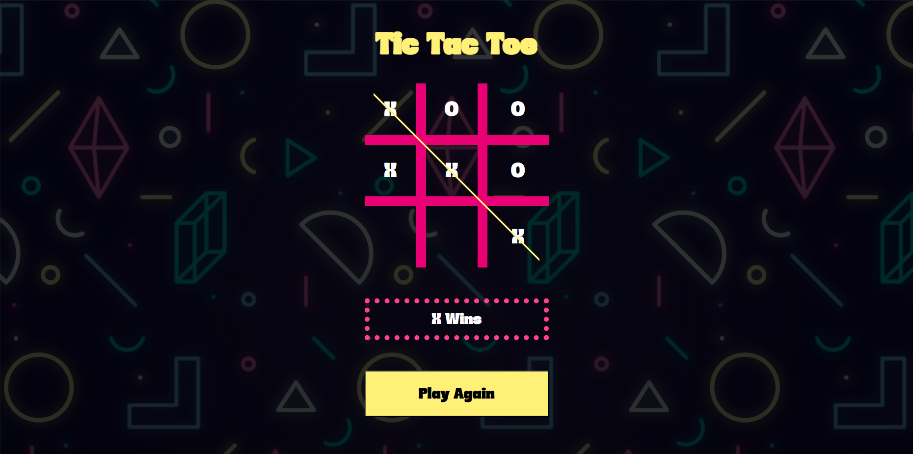
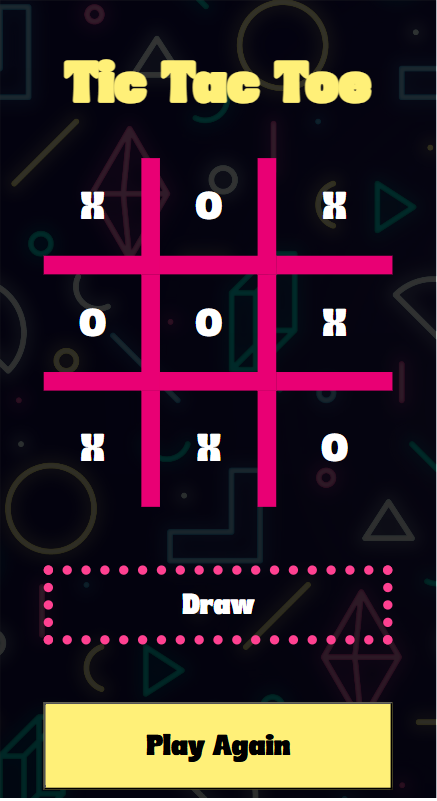

# Tic Tac Toe Game

## Description

This is a simple implementation of the classic Tic Tac Toe game. The game can be played between two players on a 3x3 grid, where the objective is to align three of your symbols (X or O) in a row, column, or diagonal.





## Installation

To get a copy of the project up and running locally, follow these steps:

1. **Clone the repository:**

   ```bash
   git clone https://github.com/your-username/tic-tac-toe-game.git
   cd tic-tac-toe-game
   ```

2. **Install the dependencies:**

   ```bash
   npm install
   ```

3. **Run the game:**

   ```bash
   npm start
   ```

## Usage

Start the game by running the application and enjoy a match of Tic Tac Toe with a friend. Players take turns clicking on a square to place their symbol. The first player to get three in a row wins!

## Contributing

If you'd like to contribute to the project, feel free to fork the repository and submit a pull request with your changes.

1. Fork the repository.
2. Create a new branch (`git checkout -b feature-branch`).
3. Commit your changes (`git commit -m 'Add new feature'`).
4. Push to the branch (`git push origin feature-branch`).
5. Open a pull request.

## License

This project is licensed under the MIT License - see the LICENSE.md file for details.
